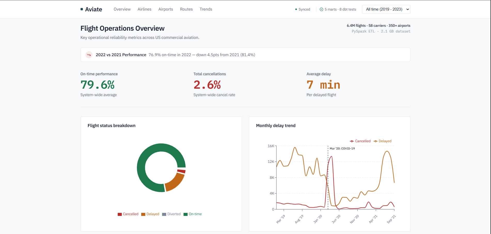
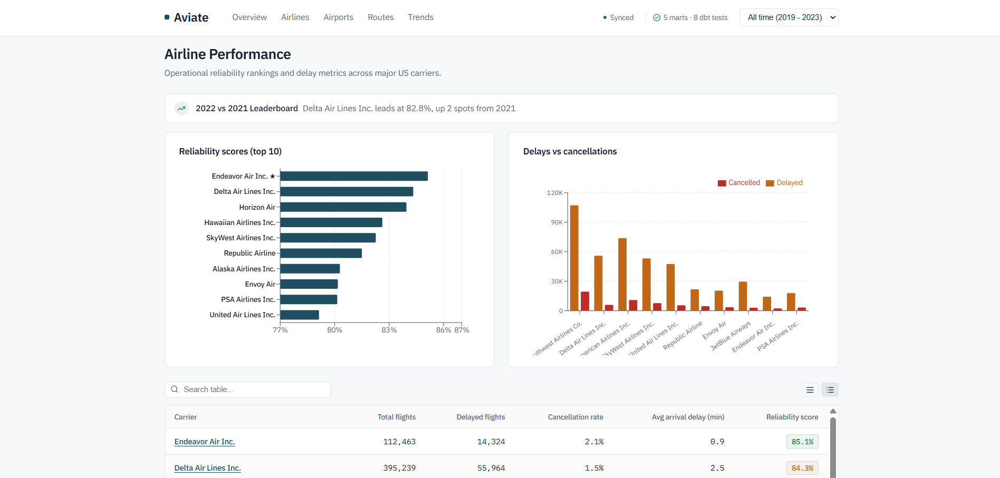
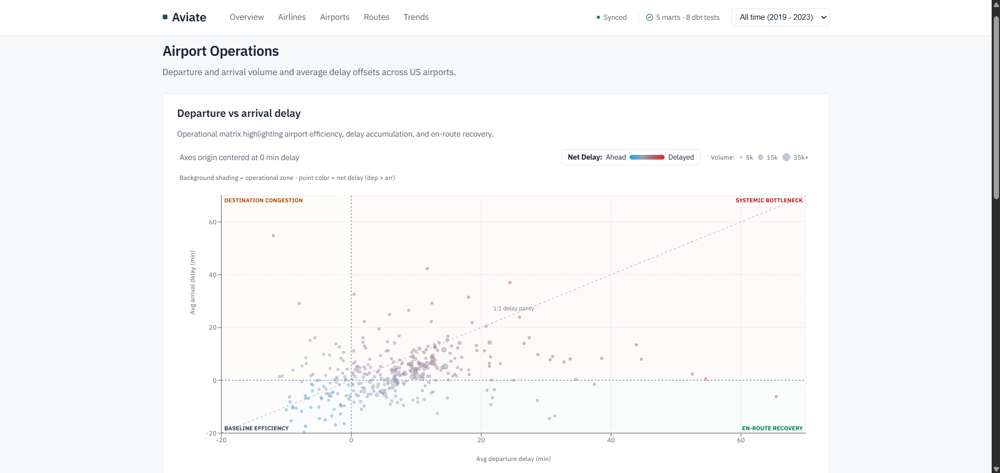
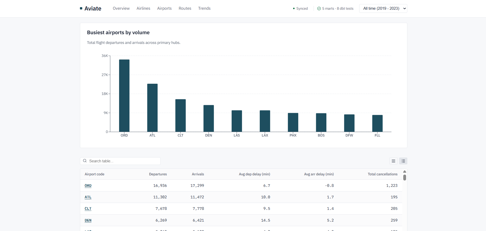
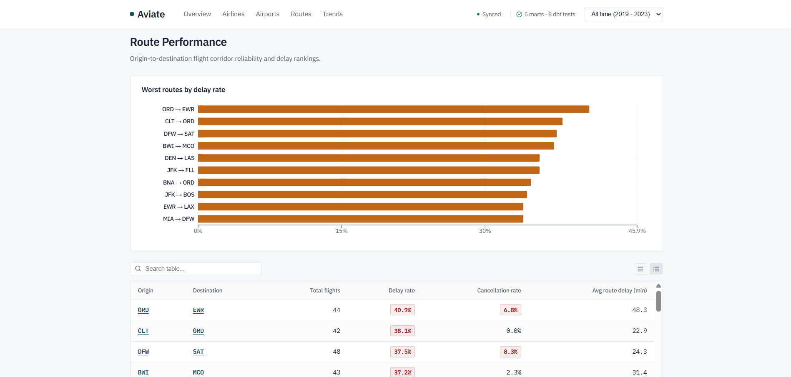
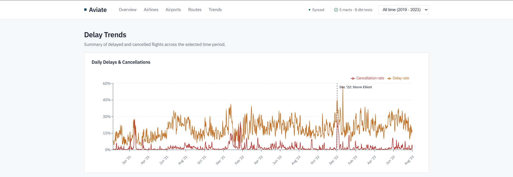
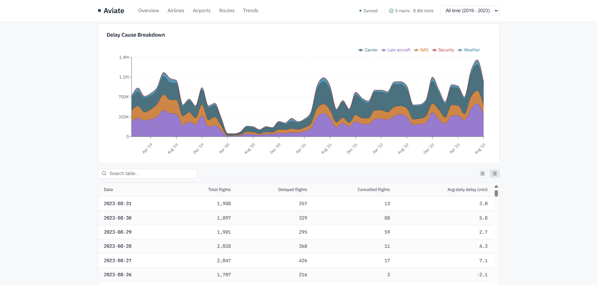
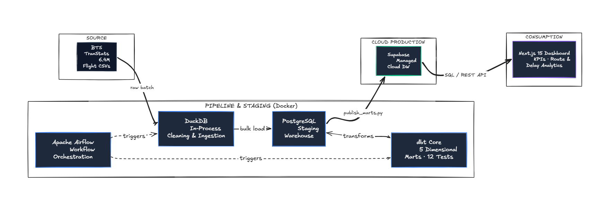

# Aviate — Flight Operations Analytics Platform

[](https://nextjs.org/)
[](https://duckdb.org/)
[](https://www.getdbt.com/)
[](https://airflow.apache.org/)
[](https://www.postgresql.org/)
[](https://supabase.com/)
[](https://www.typescriptlang.org/)

**Aviate** is an end-to-end data pipeline and analytics dashboard for US commercial flight data from the Bureau of Transportation Statistics (BTS). It processes millions of flight records using DuckDB and dbt, orchestrates workflows with Airflow, and serves clean performance metrics through a Next.js web application.

---

## Dashboard Showcase

### 1. Operations Overview
Key operational metrics including on-time rate, cancellations, average delays, flight status distribution, and multi-year delay trends.



---

### 2. Airline Performance & Reliability
Rankings of US commercial air carriers comparing on-time performance, flight volumes, and delays vs. cancellations.



---

### 3. Airport Operations & Congestion
Scatter matrix comparing departure vs. arrival delays across 350+ US airports with IATA code resolution and full hub metrics.



Searchable airport table with departures, arrivals, average delays, and cancellation rates:



---

### 4. Route Performance & Corridor Reliability
Corridor analytics identifying route volumes, delay rates, and cancellation frequencies between origin and destination airports.



---

### 5. Historical Trends & Delay Causes
Time-series tracking of daily delay patterns alongside a categorical breakdown of delay causes (Carrier, Late Aircraft, NAS, Weather, Security).




---

##  Architecture & Data Pipeline



<details>
<summary>Click to view ASCII Pipeline Diagram</summary>

```
┌─────────────────────────┐
│ Bureau of Transportation│
│    Statistics (BTS)     │
│   (6.4M Flight CSVs)    │
└────────────┬────────────┘
             │
             ▼
┌─────────────────────────┐
│     Apache Airflow      │  ◄── DAG Orchestration & Scheduling
└────────────┬────────────┘
             │
             ▼
┌─────────────────────────┐
│         DuckDB          │  ◄── In-Process Analytical Processing, Vectorized
│   (High-Perf Engine)    │      Cleaning, Schema Enforcement & Type Casting
└────────────┬────────────┘
             │
             ▼
┌─────────────────────────┐
│    PostgreSQL (DW)      │  ◄── High-Throughput Bulk Staging Warehouse
└────────────┬────────────┘
             │
             ▼
┌─────────────────────────┐
│        dbt Core         │  ◄── 5 Dimensional Analytical Marts +
│   (Postgres Adapter)    │      8 Data Quality Tests
└────────────┬────────────┘
             │
             ▼
┌─────────────────────────┐
│  publish_marts (Sync)   │  ◄── Batched Cloud Synchronization (page_size=5000)
└────────────┬────────────┘
             │
             ▼
┌─────────────────────────┐
│   Supabase Cloud DB     │  ◄── Secure Managed Cloud Warehouse
└────────────┬────────────┘
             │
             ▼
┌─────────────────────────┐
│     Next.js 15 App      │  ◄── Server Components, Recharts, Custom Design
│       (Dashboard)       │      Tokens & Tabular Numerals
└─────────────────────────┘
```
</details>

---

##  Analytical Data Marts (dbt)

The transformation layer produces 5 curated data marts modeled for low-latency querying:

| Mart Name | Granularity | Key Metrics | dbt Tests |
| :--- | :--- | :--- | :--- |
| **`mart_airline_performance`** | `carrier`, `flight_month` | Total flights, delayed flights, cancelled flights, avg delay min, reliability score | `unique`, `not_null` |
| **`mart_airport_performance`** | `airport_code`, `flight_month` | Departures, arrivals, avg departure delay, avg arrival delay, cancellations | `unique`, `not_null` |
| **`mart_route_reliability`** | `origin`, `dest`, `carrier`, `flight_month` | Corridor flight count, delay rate, cancellation rate, avg corridor delay | `not_null` |
| **`mart_delay_trends`** | `flight_date` | Daily total flights, delayed flights, cancelled flights, avg daily delay | `unique`, `not_null` |
| **`mart_delay_causes`** | `carrier`, `flight_month` | Carrier delay, weather delay, NAS delay, security delay, late aircraft delay | `not_null` |

---

##  Technology Stack

| Layer | Technologies | Description |
| :--- | :--- | :--- |
| **Analytical Ingestion** | `DuckDB 1.0+` | Vectorized SQL cleaning, schema validation, and null resolution across 6.4M rows |
| **Orchestration** | `Apache Airflow 2.9+` | Containerized DAG scheduling (`historical_backfill`, `monthly_flight_refresh`) |
| **Data Transformation** | `dbt Core 1.12+` | SQL modeling, incremental aggregation, and automated testing assertions |
| **Local Staging Storage** | `PostgreSQL 15` | Staging data warehouse containerized via Docker |
| **Cloud Serving Warehouse** | `Supabase` | Managed Cloud PostgreSQL layer serving the dashboard |
| **Web Dashboard** | `Next.js 15`, `React 19`, `TypeScript` | Server Components, responsive data visualization, and custom design tokens |
| **Data Visualization** | `Recharts` | Pseudo-heatmap scatter matrices, area charts, and grouped bar visualizations |
| **Containerization** | `Docker`, `Docker Compose` | Multi-container environment (Airflow Init/Web/Scheduler, PostgreSQL) |

---

## Quickstart

```bash
# 1. Clone repo & setup env
git clone https://github.com/ayushcodes27/aviate.git && cd aviate
cp .env.example .env

# 2. Launch infrastructure (Postgres, Airflow)
docker compose up -d

# 3. Run DuckDB ingestion & dbt transformations
docker exec -e POSTGRES_HOST=postgres aviate_airflow_scheduler python3 /opt/airflow/processing/duckdb_flights.py --file flights_sample_3m.csv --period 2023-Q1
docker exec -e POSTGRES_HOST=postgres aviate_airflow_scheduler bash -c "cd /opt/airflow/transform && dbt build --profiles-dir ."

# 4. Sync marts to Supabase & launch dashboard
python sync/publish_marts.py
cd dashboard && npm install && npm run dev
```

> **Services**: Dashboard (`http://localhost:3000`) • Airflow (`http://localhost:8085` admin/admin) • Postgres (`localhost:5434`)

---

## Repository Structure

```
├── dashboard/       # Next.js 15 analytics dashboard & visualization layer
├── ingestion/       # BTS flight data extraction & registration scripts
├── orchestration/   # Apache Airflow DAGs (backfill & monthly refresh)
├── processing/      # DuckDB batch cleaning & transformation scripts
├── sync/            # Cloud data mart synchronization (publish_marts.py)
├── transform/       # dbt models, data marts & schema tests
└── docker-compose.yml
```

---

##  Data Quality & Testing

Data integrity is enforced at every layer of the pipeline:
1. **DuckDB Schema Validation**: Drops orphan flight records, enforces typed column conversions, casts categorical carrier codes, and treats null delay offsets.
2. **dbt Assertions**:
   - `unique` constraints on carrier-month and airport-month combinations.
   - `not_null` assertions across all primary delay metrics.
   - Referential integrity checks between staging views and marts.
3. **Continuous Monitoring**: Pipeline latency, execution duration, and row throughput are tracked via the persistent [Pipeline Architecture](dashboard/src/app/pipeline/page.tsx) monitor.

---

##  License
This project is licensed under the MIT License — see the [LICENSE](LICENSE) file for details.
